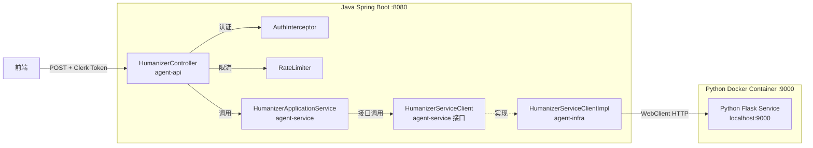

# 设计文档

## 概述

本设计将独立运行的 Python Flask Humanizer/AI检测服务通过 Java Spring Boot 后端进行安全代理。遵循现有 DDD 分层架构（agent-api → agent-service → agent-infra），在 Java 端新增 Controller、领域接口和基础设施实现，通过 WebClient 调用 Python 服务。SSE 流式代理使用 Spring 的 `SseEmitter` 配合 WebClient 的响应式流实现透传。全局限流使用内存滑动窗口算法，无需引入外部依赖。

## 架构



### 请求流程

1. 前端携带 Clerk Token 发送请求到 Java API
2. `AuthInterceptor` 验证 Token（复用现有逻辑，`/v1/humanizer/**` 路径已在拦截范围内）
3. `HumanizerController` 接收请求，调用 `RateLimiter` 检查限流
4. 通过 `HumanizerApplicationService` 调用领域接口
5. `HumanizerServiceClientImpl` 使用独立 WebClient 转发请求到 Python 服务
6. 响应原路返回（SSE 流式或普通 JSON）

## 组件与接口

### 1. HumanizerController（agent-api 层）

```java
@RestController
@RequestMapping("/v1/humanizer")
@RequiredArgsConstructor
public class HumanizerController {

    private final HumanizerApplicationService humanizerApplicationService;
    private final HumanizerRateLimiter rateLimiter;

    /**
     * AI 检测 SSE 流式接口
     * 返回 SseEmitter，透传 Python 服务的 SSE 事件
     */
    @PostMapping("/detect-stream")
    public SseEmitter detectStream(
            @RequestBody HumanizerDetectRequest request,
            @RequestAttribute("clerkUserId") String clerkUserId) {
        rateLimiter.checkDetectStreamLimit();
        return humanizerApplicationService.detectAIStream(request.getText());
    }

    /**
     * 文本人性化改写接口
     */
    @PostMapping("/process")
    public Result<HumanizerProcessResponse> process(
            @RequestBody HumanizerProcessRequest request,
            @RequestAttribute("clerkUserId") String clerkUserId) {
        rateLimiter.checkProcessLimit();
        HumanizerProcessResponse response = humanizerApplicationService.humanize(request.getText());
        return Result.success(response);
    }
}
```

### 2. HumanizerServiceClient 接口（agent-service 领域层）

```java
/**
 * Humanizer 服务客户端接口（领域层定义）
 */
public interface HumanizerServiceClient {

    /**
     * AI 检测 SSE 流式调用
     * @param text 待检测文本
     * @return Flux 响应式流，每个元素为一个 SSE 事件字符串
     */
    Flux<String> detectAIStream(String text);

    /**
     * 文本人性化改写
     * @param text 待改写文本
     * @return 改写结果
     */
    HumanizerResult humanize(String text);
}
```

### 3. HumanizerServiceClientImpl（agent-infra 层）

```java
@Slf4j
@Component
@RequiredArgsConstructor
public class HumanizerServiceClientImpl implements HumanizerServiceClient {

    private final WebClient humanizerWebClient; // 独立 WebClient，5分钟超时

    @Value("${humanizer-service.url:http://localhost:9000}")
    private String humanizerServiceUrl;

    @Override
    public Flux<String> detectAIStream(String text) {
        // 使用 WebClient 消费 Python SSE 流，返回原始 SSE 事件行
        return humanizerWebClient.post()
            .uri(humanizerServiceUrl + "/predict_stream")
            .bodyValue(Map.of("text", text))
            .accept(MediaType.TEXT_EVENT_STREAM)
            .retrieve()
            .bodyToFlux(String.class);
    }

    @Override
    public HumanizerResult humanize(String text) {
        // 同步调用 Python /process 端点
        Map response = humanizerWebClient.post()
            .uri(humanizerServiceUrl + "/process")
            .bodyValue(Map.of("text", text))
            .retrieve()
            .bodyToMono(Map.class)
            .block();
        // 解析响应并返回 HumanizerResult
    }
}
```

### 4. HumanizerRateLimiter（agent-api 层）

```java
/**
 * 全局限流器 - 基于滑动窗口算法
 * 使用 ConcurrentLinkedDeque 存储请求时间戳
 */
@Component
public class HumanizerRateLimiter {

    // detect-stream: 10 req/min
    private final ConcurrentLinkedDeque<Long> detectTimestamps = new ConcurrentLinkedDeque<>();
    // process: 5 req/min
    private final ConcurrentLinkedDeque<Long> processTimestamps = new ConcurrentLinkedDeque<>();

    @Value("${humanizer-service.rate-limit.detect-stream:10}")
    private int detectStreamLimit;

    @Value("${humanizer-service.rate-limit.process:5}")
    private int processLimit;

    public void checkDetectStreamLimit() {
        checkLimit(detectTimestamps, detectStreamLimit, "AI Detect Stream");
    }

    public void checkProcessLimit() {
        checkLimit(processTimestamps, processLimit, "Humanizer Process");
    }

    private void checkLimit(ConcurrentLinkedDeque<Long> timestamps, int maxRequests, String endpoint) {
        long now = System.currentTimeMillis();
        long windowStart = now - 60_000; // 1分钟窗口
        // 清除过期时间戳
        while (!timestamps.isEmpty() && timestamps.peekFirst() < windowStart) {
            timestamps.pollFirst();
        }
        if (timestamps.size() >= maxRequests) {
            throw new RateLimitExceededException(endpoint);
        }
        timestamps.addLast(now);
    }
}
```

### 5. HumanizerWebClientConfig（agent-infra 层）

```java
@Configuration
public class HumanizerWebClientConfig {

    /**
     * 为 Humanizer 服务创建独立 WebClient
     * 读取超时 5 分钟，适应多步翻译链的长耗时
     */
    @Bean("humanizerWebClient")
    public WebClient humanizerWebClient() {
        HttpClient httpClient = HttpClient.create()
            .option(ChannelOption.CONNECT_TIMEOUT_MILLIS, 5000)
            .responseTimeout(Duration.ofMinutes(5))
            .doOnConnected(conn -> conn
                .addHandlerLast(new ReadTimeoutHandler(5, TimeUnit.MINUTES))
                .addHandlerLast(new WriteTimeoutHandler(30, TimeUnit.SECONDS))
            );
        return WebClient.builder()
            .clientConnector(new ReactorClientHttpConnector(httpClient))
            .build();
    }
}
```

### 6. SSE 透传机制

Controller 中使用 `SseEmitter` 将 `Flux<String>` 转换为 SSE 响应：

```java
public SseEmitter detectStream(String text) {
    SseEmitter emitter = new SseEmitter(300_000L); // 5分钟超时
    Flux<String> sseFlux = humanizerServiceClient.detectAIStream(text);

    sseFlux.subscribe(
        data -> {
            try {
                // 解析 Python SSE 事件并重新发射
                emitter.send(SseEmitter.event()
                    .name(eventName)  // chunk / done / error
                    .data(eventData));
            } catch (IOException e) {
                emitter.completeWithError(e);
            }
        },
        emitter::completeWithError,
        emitter::complete
    );

    return emitter;
}
```

## 数据模型

### 请求 DTO

```java
// AI 检测请求
@Data
public class HumanizerDetectRequest {
    @NotBlank(message = "text 不能为空")
    private String text;
}

// 人性化改写请求
@Data
public class HumanizerProcessRequest {
    @NotBlank(message = "text 不能为空")
    private String text;
}
```

### 响应 DTO

```java
// 人性化改写响应
@Data
@Builder
public class HumanizerProcessResponse {
    private String result;         // 改写后的文本
    private Double elapsedSeconds; // 耗时（秒）
}
```

### 领域模型

```java
// Humanizer 服务返回结果（领域层）
@Data
public class HumanizerResult {
    private int code;
    private String msg;
    private String result;
    private Double elapsedSeconds;
}
```

### SSE 事件模型（用于 Java 端解析和重发射）

Python 服务返回的 SSE 事件格式：

```
event: chunk
data: {"index":1,"total":5,"sentence":"...","fullSentence":"...","probability":0.87,"label":"AI","weight":42}

event: done
data: {"probability":0.85,"label":"AI Generated","totalChunks":5,"elapsed_seconds":1.23}

event: error
data: {"msg":"error message"}
```

Java 端不需要将 SSE 数据反序列化为 Java 对象，直接透传原始 JSON 字符串即可。只需解析 `event:` 行获取事件名称。

### 配置模型

```yaml
# application.yml 新增配置
humanizer-service:
  url: ${HUMANIZER_SERVICE_URL:http://47.88.58.79:9000}
  rate-limit:
    detect-stream: 10  # 每分钟最大请求数
    process: 5          # 每分钟最大请求数
```


## 正确性属性

*正确性属性是一种在系统所有有效执行中都应成立的特征或行为——本质上是关于系统应该做什么的形式化陈述。属性作为人类可读规范与机器可验证正确性保证之间的桥梁。*

### Property 1: SSE 事件透明转发

*For any* SSE 事件（chunk、done 或 error 类型）从 Python 服务返回，Java 代理转发后的事件名称和数据内容应与原始事件完全一致。

**Validates: Requirements 1.2, 1.3, 1.4**

### Property 2: 空文本输入验证

*For any* 由纯空白字符组成的字符串（包括空字符串），提交到 detect-stream 或 process 端点时，系统应返回 400 错误码且不向 Python 服务发起请求。

**Validates: Requirements 1.5, 2.3**

### Property 3: 限流器在窗口内强制执行请求上限

*For any* 配置了限制 N 的端点，在 1 分钟滑动窗口内连续发送 N+1 个请求时，前 N 个请求应被允许，第 N+1 个请求应被拒绝并返回 429 状态码。

**Validates: Requirements 4.1, 4.2, 4.3**

### Property 4: 限流器滑动窗口过期

*For any* 已达到限流上限的端点，当最早的请求时间戳超出 1 分钟窗口后，新的请求应被允许通过。

**Validates: Requirements 4.4**

### Property 5: Process 响应包装保持数据完整

*For any* Python 服务返回的成功响应（code=200），Java 代理包装后的 Result 对象中 data.result 字段应与原始响应的 data.result 字段值相同，data.elapsedSeconds 应与原始 elapsed_seconds 值相同。

**Validates: Requirements 2.2**

### Property 6: Process 错误传播

*For any* Python 服务返回的错误响应（code≠200），Java 代理应返回包含原始错误信息的错误响应，不丢失错误描述。

**Validates: Requirements 2.4**

## 错误处理

### 1. Python 服务不可达

- 场景：Python Docker 容器未启动或网络不通
- 处理：`HumanizerServiceClientImpl` 捕获 `WebClientRequestException`，记录错误日志
  - SSE 端点：发送 `event: error` 事件后关闭 SseEmitter
  - Process 端点：返回 `Result.error(503, "Humanizer service unavailable")`

### 2. Python 服务超时

- 场景：`/process` 端点因多步翻译链耗时超过 5 分钟
- 处理：WebClient 抛出 `ReadTimeoutException`
  - Process 端点：返回 `Result.error(504, "Humanizer service timeout")`
  - SSE 端点：SseEmitter 超时回调触发，发送 error 事件

### 3. Python 服务返回错误

- 场景：Python 服务返回 429（busy）、503（model not loaded）、400（bad input）等
- 处理：解析 Python 响应中的 code 和 msg 字段，映射为 Java 端对应的错误响应

### 4. 限流触发

- 场景：全局请求频率超过阈值
- 处理：`HumanizerRateLimiter` 抛出 `RateLimitExceededException`
- 响应：由 `GlobalExceptionHandler` 捕获，返回 429 状态码和描述信息
- 需要在 `GlobalExceptionHandler` 中新增 `RateLimitExceededException` 处理方法

### 5. 请求参数无效

- 场景：text 字段为空或缺失
- 处理：使用 `@NotBlank` 注解 + `@Valid` 验证，由现有 `GlobalExceptionHandler` 的 `MethodArgumentNotValidException` 处理器返回 400

### 6. SSE 连接中断

- 场景：前端主动关闭连接或网络中断
- 处理：SseEmitter 的 `onCompletion` 和 `onError` 回调中取消上游 Flux 订阅，释放资源

## 测试策略

### 属性测试（Property-Based Testing）

使用 **jqwik**（Java 属性测试库）实现正确性属性验证。每个属性测试运行至少 100 次迭代。

| 属性 | 测试方法 | 生成器 |
|------|---------|--------|
| Property 1: SSE 事件透明转发 | 生成随机 SSE 事件（随机事件名 + 随机 JSON 数据），验证解析-重发射后数据一致 | 随机事件名（chunk/done/error）+ 随机 JSON 字符串 |
| Property 2: 空文本输入验证 | 生成随机空白字符串，验证验证逻辑拒绝 | 空字符串、空格、制表符、换行符的随机组合 |
| Property 3: 限流器窗口内上限 | 生成随机限流阈值 N（1-20），发送 N+1 请求验证 | 随机整数 N |
| Property 4: 限流器滑动窗口过期 | 生成随机请求序列和时间偏移，验证过期后允许新请求 | 随机时间戳序列 |
| Property 5: Process 响应包装 | 生成随机 result 字符串和 elapsedSeconds，验证包装后数据一致 | 随机字符串 + 随机 Double |
| Property 6: Process 错误传播 | 生成随机错误码和错误消息，验证传播后信息不丢失 | 随机非200整数 + 随机字符串 |

每个属性测试必须标注对应的设计属性编号：
- 标签格式：`Feature: humanizer-integration, Property {N}: {property_text}`

### 单元测试

单元测试聚焦于具体示例和边界情况：

- `HumanizerController` 端点路由和参数验证
- `HumanizerRateLimiter` 边界条件（恰好达到限制、窗口边界）
- `HumanizerServiceClientImpl` 对 Python 服务各种响应的解析
- SSE 事件解析逻辑的边界情况（畸形事件、空数据）
- 认证拦截器对 `/v1/humanizer/**` 路径的覆盖验证

### 集成测试

- 使用 MockWebServer 模拟 Python 服务，验证端到端请求流程
- SSE 流式代理的完整流程测试（多个 chunk → done）
- 超时场景测试（模拟慢响应）
