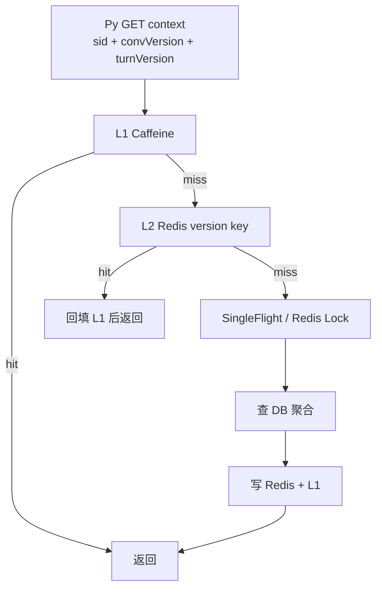
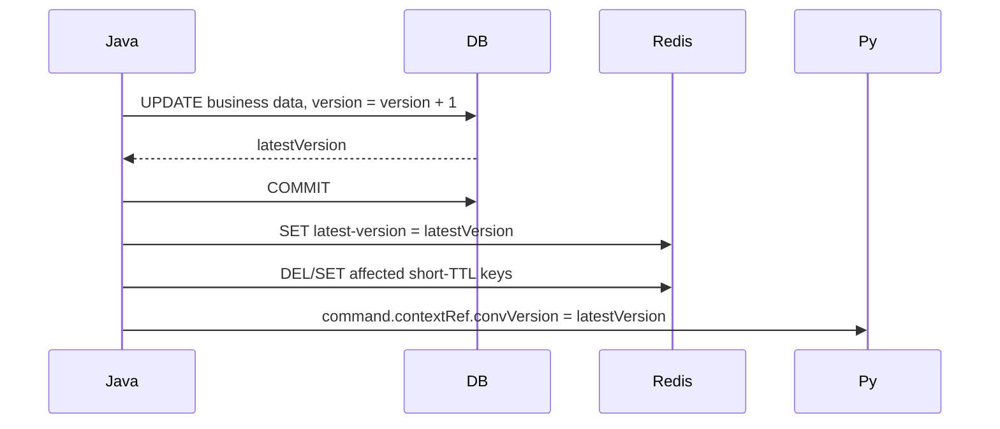

# Verla 内部查询 Redis 缓存策略设计

## 1. 目标

为 Py 反查 Java 的 `/v1/internal/verla/*` 查询接口增加 Redis 分布式缓存，降低 MySQL 压力，并支持未来 Java 多实例、Py 多 worker、Redis Cluster 扩展。

本设计覆盖内部查询，不覆盖前端用户态 `/v1/verla/*` 接口。

## 2. 当前结论

1. 默认方案：先实现 `GET /v1/internal/verla/sessions/{sid}/context` 的 L1 Caffeine + L2 Redis 缓存，并修正 version 传递；其他接口按热点逐步接入。
2. `conversation` 和 `turn` 建议使用版本化 key；`session` 使用 `sessionId` key + 短 TTL + 写后更新/删除。
3. Py 若带 `convVersion/turnVersion`，Redis 命中应直接返回，不再先查 DB version。
4. 当前代码需要先修正：`contextRef.convVersion` 要传递 DB 自增后的真实版本；`turnVersion` 目前缺真实字段。
5. Redis 故障时降级回源 DB，不因缓存异常影响 Py 执行。

## 3. 数据语义

```text
Conversation = 用户一个对话 Tab，生命周期长，跨多个 turn
Turn         = 用户一次 query 到系统完成一次回答
Session      = 一次 Python 调用，PLAN / AGENT / MATERIALS 各一条
Event        = Py 在 session 内回传的进度、结果、终态
Artifact     = agent 产出的卡片、材料或终稿
```

## 4. 接口与缓存粒度

### 4.1 Key 清单与语义

统一前缀带协议版本，便于后续整体迁移。

| Key | 语义 |
| --- | --- |
| `verla:v1:conv:{cid}:latest-version` | conversation 当前最新 version；请求缺 `convVersion` 时先读它定位最新缓存 key |
| `verla:v1:conv:{cid}:summary:v{convVer}` | 指定版本的 conversation 摘要；用于 context 与 conversation 详情类查询 |
| `verla:v1:conv:{cid}:messages:v{convVer}:before:{cursor\|latest}:limit:{limit}` | 指定版本的消息窗口；`latest` 表示最近页，`cursor` 表示 `id < cursor` 的历史页 |
| `verla:v1:turn:{tid}:latest-version` | turn 当前最新 version；请求缺 `turnVersion` 时先读它定位最新缓存 key |
| `verla:v1:turn:{tid}:meta:v{turnVer}` | 指定版本的 turn 元信息；包含状态、resolvedIntent、resolvedSlots、activeSession 等 |
| `verla:v1:turn:{tid}:upstream-sessions` | 同一 turn 内已完成的其他 session 结果；主要用于 agent 启动时读取 plan session `resultJson` |
| `verla:v1:sess:{sid}:meta` | session 元信息；包含 kind、status、resultJson、errorJson、progress 等 |
| `verla:v1:sess:{sid}:block-responses` | plan/card block 的用户回答列表；当前接口未实现，属于预留 key |
| `verla:v1:lock:conv:{cid}:summary:v{convVer}` | conv summary 回源 DB 时的防击穿锁；只用于 Redis miss 后的并发保护 |

### 4.2 查询接口与 Key 对应关系

接口返回的是 VO，Redis key 存的是组成 VO 的数据部件。`context` 接口会组合多个 key，其他接口通常对应一类 key。

| 查询接口 | 主要 Redis key | 说明 |
| --- | --- | --- |
| `GET /sessions/{sid}/context?convVersion=&turnVersion=` | `verla:v1:sess:{sid}:meta` | 当前 session 自身 |
| 同上 | `verla:v1:turn:{tid}:meta:v{turnVer}` | 当前 session 所属 turn |
| 同上 | `verla:v1:conv:{cid}:summary:v{convVer}` | conversation 摘要 |
| 同上 | `verla:v1:conv:{cid}:messages:v{convVer}:before:latest:limit:{limit}` | 最近 N 条消息 |
| 同上 | `verla:v1:turn:{tid}:upstream-sessions` | 同 turn 内已完成的其他 session，主要是 plan session 结果 |
| `GET /conversations/{cid}/messages?limit&before` | `verla:v1:conv:{cid}:messages:v{convVer}:before:{cursor\|latest}:limit:{limit}` | 历史消息窗口 |
| `GET /turns/{tid}` | `verla:v1:turn:{tid}:meta:v{turnVer}` | turn 详情 |
| `GET /sessions/{sid}` | `verla:v1:sess:{sid}:meta` | session 详情 |
| `GET /sessions/{sid}/block-responses` | `verla:v1:sess:{sid}:block-responses` | 用户对 plan/card block 的回答 |
| `GET /conversations/{cid}` | `verla:v1:conv:{cid}:summary:v{convVer}` 或单独 `verla:v1:conv:{cid}:meta:v{convVer}` | 当前代码额外接口；若只查 conversation 详情，建议单独拆 meta key |

### 4.3 辅助 Key

辅助 key 不直接对应业务返回：

| 辅助 key | 用途 |
| --- | --- |
| `verla:v1:conv:{cid}:latest-version` | 请求缺 `convVersion` 时定位最新 conversation 版本 |
| `verla:v1:turn:{tid}:latest-version` | 请求缺 `turnVersion` 时定位最新 turn 版本 |
| `verla:v1:lock:conv:{cid}:summary:v{convVer}` | conv summary miss 回源时防击穿 |

### 4.4 命名约束

约束：

- Redis Cluster 下 `{cid}` / `{tid}` / `{sid}` 是 hash tag，同一实体相关 key 落到同一 slot。
- `summary` 存 conversation 摘要，不存 session 自身。
- `upstream-sessions` 是 turn 维度数据，不塞进 conversation key。
- 所有 value 使用 JSON，不使用 JDK 序列化。
- 不同环境使用不同 key prefix，避免测试污染生产。

## 5. Key 生命周期：更新、失效、淘汰

这是查询某个 key 如何更新或淘汰时的主入口。

### 5.1 Key 维度生命周期

| Key 类型 | 更新时机 | 失效方式 | 淘汰方式 |
| --- | --- | --- | --- |
| `conv:{cid}:latest-version` | conversation 相关写入提交后更新为最新 version | 覆盖写 | 不建议设置 TTL，或设置较长 TTL 并由 miss 回源修复 |
| `conv:{cid}:summary:v{convVer}` | miss 回源后写入 | 新 version key 替代旧 key | 60s + 抖动自然过期 |
| `conv:{cid}:messages:v{convVer}:...` | miss 回源后写入 | 新消息导致 convVersion 前进，新请求转新 key | 最近页 30-60s；老页 5-10min |
| `turn:{tid}:latest-version` | turn 状态、slots、activeSession 等写入后更新 | 覆盖写 | 不建议设置 TTL，或设置较长 TTL 并由 miss 回源修复 |
| `turn:{tid}:meta:v{turnVer}` | miss 回源后写入 | turnVersion 前进，新请求转新 key | 30s + 抖动 |
| `turn:{tid}:upstream-sessions` | miss 回源后写入 | plan/agent session 终态变化后删除 | 10-30s + 抖动 |
| `sess:{sid}:meta` | miss 回源后写入；session 写入后可直接更新 | session 状态变化后更新或删除 | 非终态 5-10s；终态 5min |
| `sess:{sid}:block-responses` | miss 回源后写入 | 新 block response 写入后删除 | 60-300s + 抖动 |
| negative cache | 可信内部 ID 查无结果时写入 | 对应实体创建或修复后自然覆盖 | 10-30s |
| `lock:*` | Redis miss 抢回源锁时写入 | 持锁方释放，或自动过期 | 3s 左右 |

### 5.2 写入动作与 Key 更新

写入动作到 key 的映射：

| 写入动作 | DB 变化 | Redis 动作 |
| --- | --- | --- |
| 新 turn / 用户消息 | `conversation.version + 1` | 更新 `conv latest-version`；新 contextRef 带新 `convVersion` |
| plan resolved | `turn.version + 1`，`conversation.version + 1`，plan session 终态 | 更新 conv/turn latest；更新或删除 plan session；删除 upstream key |
| plan needs clarify | `turn.version + 1`，新增 assistant message | 更新 turn latest；若消息进入上下文，bump convVersion |
| agent started | session 状态变化 | 更新或删除 `sess:{sid}:meta` |
| agent completed | session 终态，turn 终态，`conversation.version + 1` | 更新 session 终态；更新 conv/turn latest；删除 upstream key |
| agent failed/cancelled | session/turn 终态 | 更新 session/turn cache；必要时 bump convVersion |
| artifact updated | `artifact.version + 1`，`conversation.version + 1` | 后续 artifact cache 单独设计；更新 conv latest |
| block response inserted | 新增 block response | 删除 `sess:{sid}:block-responses` |
| rename/archive/delete conversation | conversation 字段变化 | 若字段进入 internal context，应 bump convVersion |

### 5.3 一致性原则

原则：凡是会影响 Py context 的字段变化，都必须推进对应 version 或删除短 TTL key。

## 6. TTL 设置

| 数据 | TTL | 说明 |
| --- | --- | --- |
| conv latest-version | 无 TTL 或长 TTL | miss 可回源 DB 修复 |
| conv summary | 60s + 10%-20% 抖动 | 版本化 key，旧 key 等 TTL 自然淘汰 |
| messages 最近页 | 30-60s + 抖动 | `latest` 页随 convVersion 漂移 |
| messages 老页 | 5-10min + 抖动 | 历史消息基本不可变，可按容量控制启用 |
| turn latest-version | 无 TTL 或长 TTL | miss 可回源 DB 修复 |
| turn meta | 30s + 抖动 | 版本化 key |
| session meta 非终态 | 5-10s + 抖动 | 状态变化频繁 |
| session meta 终态 | 5min + 抖动 | 终态 result/error 基本稳定 |
| upstream sessions | 10-30s + 抖动 | plan 完成后 agent 启动会读取 |
| block responses | 60-300s + 抖动 | 写入后删除 list |
| negative cache | 10-30s | 只缓存可信内部 ID 的 404，防穿透 |

TTL 必须加随机抖动，避免大批 key 同时过期。

## 7. 读路径

### 7.1 带 version 的读取



关键原则：请求带 `convVersion/turnVersion` 时，命中版本化 key 即返回，不再先查 DB 校验最新 version。

### 7.2 缺 version 的读取

```text
1. 先读 Redis latest-version。
2. latest-version 命中后拼版本化 key 读缓存。
3. latest-version miss 或版本化 key miss 时回源 DB。
4. 回源后写 latest-version 和版本化 key。
```

缺 version 的接口不能直接信任缓存中的任意版本。

## 8. 写路径

写 DB 成功并提交后，再更新 Redis。避免事务回滚但缓存已更新。



建议 repository 写方法返回新版本：

```java
Long bumpConversationVersion(Long conversationId);
Long bumpTurnVersion(Long turnId);
```

MySQL 可用两步实现：事务内 `UPDATE version = version + 1` 后 `SELECT version`。若要减少一次查询，可评估 `LAST_INSERT_ID(version + 1)` 写法，但先以清晰可靠为主。

## 9. Context 接口聚合设计

`GET /sessions/{sid}/context` 建议拆成四类缓存：

```text
session meta        -> verla:v1:sess:{sid}:meta
turn meta           -> verla:v1:turn:{tid}:meta:v{turnVer}
conv summary        -> verla:v1:conv:{cid}:summary:v{convVer}
recent messages     -> verla:v1:conv:{cid}:messages:v{convVer}:before:latest:limit:{limit}
upstream sessions   -> verla:v1:turn:{tid}:upstream-sessions
```

返回结构仍由 Java 聚合：

```text
VerlaSessionContextVO =
  session meta
  + turn meta
  + conv summary
  + recent messages
  + upstream sessions
```

不要把完整 `VerlaSessionContextVO` 按 `sid` 整体缓存为唯一方案。整体缓存简单，但任一子对象变化都会导致整个上下文失效，且不利于复用 conversation 和 turn 维度缓存。

## 10. 防击穿、防穿透、雪崩和热点

### 10.1 SingleFlight 与防击穿

保留当前 JVM 内 SingleFlight，减少单实例重复 DB load。Redis 化后增加跨实例保护：

```text
1. L1 miss
2. Redis miss
3. SET lockKey value NX PX 3000
4. 抢到锁的实例回源 DB 并写 Redis
5. 未抢到锁的实例短暂等待后重读 Redis
6. 超时仍 miss 时允许少量请求回源，避免锁故障阻塞
```

锁只保护热点聚合 key，不要给所有普通 `session meta` 读都加分布式锁。

### 10.2 穿透、雪崩、热点

- 穿透：对可信内部 ID 的 404 做 10-30s negative cache；非法参数直接 400，不缓存。
- 雪崩：所有 TTL 加 10%-20% 随机抖动。
- 热点：context 的 conv summary 和 recent messages 加 Redis lock；本地 Caffeine 做 L1。
- 大 value：消息窗口限制 `limit <= 100`，context recent message 使用配置上限。
- Key 膨胀：版本化旧 key 不主动删除，但 TTL 不宜过长；必要时按 `verla:v1:*` 统计 keyspace。

## 11. 多实例与扩展

1. Java 多实例：Redis 是 L2 共享缓存；Caffeine 仅做 L1 短 TTL。
2. Py 多 worker：Py 只依赖 command 中的 `contextRef` 和 HTTP GET，不直接读 Redis。
3. Redis Cluster：避免 Lua 跨 slot；跨实体聚合用多次 GET，不要求原子 MGET。
4. SSE 多实例：本方案不依赖 SSE 单实例；后续可用 Redis Pub/Sub 做 SSE 扇出。
5. 其他工具服务：只能通过 internal HTTP 查询，不直接耦合 Redis key。

如需强制清理其他 Java 实例的 L1，可后续增加 Redis Pub/Sub：

```text
channel: verla:cache:invalidate
payload: {"type":"session","id":9001}
```

MVP 可先依赖 L1 短 TTL + L2 Redis 一致性。

## 12. Redis 不可用策略

- 读缓存异常：记录指标，直接回源 DB，不影响 Py 执行。
- 写缓存异常：DB 提交成功即业务成功；记录告警，由 TTL 和后续 miss 自愈。
- Redis 连续异常：短期开启熔断，避免每次请求都等待 Redis timeout。
- 不允许因为 Redis 故障返回 5xx，除非 DB 回源也失败。

## 13. 序列化与安全

缓存 value 使用 JSON 包装：

```json
{
  "schemaVersion": 1,
  "cachedAt": "2026-04-26T10:00:00+08:00",
  "version": 7,
  "data": {}
}
```

要求：

- 禁止使用 JDK 原生序列化。
- Redis 部署在私有网络，开启 ACL/密码；生产环境建议 TLS。
- 日志只打 key、version、hit/miss，不打用户消息正文。

## 14. 配置建议

```yaml
verla:
  cache:
    enabled: true
    l1-enabled: true
    key-prefix: verla:v1
    ttl:
      conv-summary: 60s
      messages-recent: 60s
      turn-meta: 30s
      session-running: 10s
      session-terminal: 300s
      upstream-sessions: 30s
      block-responses: 120s
      negative: 20s
    jitter-ratio: 0.15
    singleflight:
      enabled: true
      redis-lock-timeout: 3s
```

当前代码里的 `verla.context-cache.conv-summary-ttl-seconds` 与 `application.yml` 的 `conv-summary-ttl: 60s` 命名不一致，落实现时应统一为 `Duration` 配置。

## 15. 监控指标

至少记录：

```text
verla.cache.request.total{endpoint,entity}
verla.cache.hit.total{layer=l1|redis|none,entity}
verla.cache.load.db.total{entity}
verla.cache.load.duration{entity}
verla.cache.lock.wait.duration{entity}
verla.cache.error.total{op=read|write|serialize}
verla.cache.value.bytes{entity}
verla.context.query.duration{hitLayer}
```

告警建议：

- Redis miss 率持续升高。
- DB fallback QPS 超过基线。
- Redis read/write error 持续出现。
- context P95 超过目标阈值。

## 16. 前置改造

1. `verla_turns` 增加 `version BIGINT NOT NULL DEFAULT 1`。
2. 所有影响 turn context 的写入都执行 `turn.version + 1`。
3. `conversationRepository.incrementVersion()` 返回最新 version。
4. `contextRef` 必须带自增后的 `convVersion`，并补 `turnVersion`。
5. `VerlaContextQueryService` 读路径调整为：L1 -> Redis -> DB，不再命中前强制查 DB version。
6. `block-responses` 查询接口和 repository 落地后再接缓存。

## 17. 分阶段落地

### 17.1 Phase 1：修正版本传递与配置

- 修复 `convVersion` 传旧值的问题。
- 增加 `turn.version`。
- 统一 cache 配置命名与单位。

### 17.2 Phase 2：context 接口 Redis 化

- 引入 Redis 依赖和配置。
- 为 session/turn/conv summary/recent messages/upstream sessions 建缓存组件。
- 保留 Caffeine 作为 L1。
- 保留 JVM SingleFlight，热点 key 增加 Redis lock。

### 17.3 Phase 3：补全其他内部接口

- messages 最近页缓存。
- session/turn 详情缓存。
- block-responses 接口实现后增加 list 缓存。

### 17.4 Phase 4：多实例增强

- L1 失效 Pub/Sub。
- Redis Cluster 压测。
- 根据指标决定是否增加预热或热点 key 复制。
